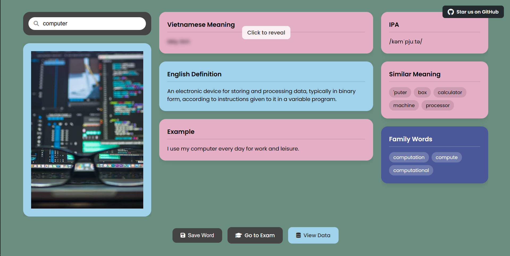

# MyVocab

<table>
<tr>
<td width="70%" style="vertical-align: top;">

[MyVocab](https://my-vocab-xi.vercel.app/) is a modern, AI-powered web app to help you learn English vocabulary efficiently. It provides definitions, Vietnamese translations, example sentences, pronunciation, synonyms, related words, and images for any English word. You can save words, organize them by topics, and test yourself with quizzes. Powered by Google Gemini AI and built with Flask.

</td>
<td width="30%" style="vertical-align: top; text-align: center;">


</td>
</tr>
</table>

---

## Tech Stack


---

## Features

- **Smart Dictionary**: Get English definitions, Vietnamese meanings, example sentences, IPA pronunciation, synonyms, related words, and an image for any English word.
- **Topic Management**: Organize your vocabulary by custom topics.
- **Save Words**: Save words to your personal database and manage them easily.
- **Quiz Mode**: Test your knowledge with topic-based quizzes.
- **Modern UI**: Responsive, clean, and intuitive interface.
- **AI Integration**: Uses Google Gemini for rich, contextual word data.
- **Image Support**: Fetches relevant images for words (if Pexels API key is provided).
- **Password-Protected Data**: Secure access to your saved data.

---

## Demo



---

## Usage

- **Search**: Enter an English word and press Enter.
- **View Details**: See definition, translation, example, IPA, synonyms, related words, and image.
- **Save**: Click "Save Word" and assign it to topics.
- **Manage Topics**: Add or remove topics as you like.
- **Quiz**: Go to "Exam" to test yourself on saved words by topic.
- **Data**: View and manage all your saved words (password-protected).

---

## Project Structure

```
MyVocab/
│
├── api/                  # Vercel/production entrypoint
│   └── index.py
│
├── my_website/           # Main Flask app
│   ├── app.py            # Flask app and routes
│   ├── handle_request.py # AI, translation, and API logic
│   ├── database.py       # PostgreSQL DB logic
│   ├── static/           # JS, CSS, client assets
│   │   ├── style.css
│   │   ├── script.js
│   │   ├── data.js
│   │   ├── exam.js
│   │   └── manage_topics.js
│   └── templates/        # HTML templates (Jinja2)
│       ├── index.html
│       ├── exam.html
│       ├── data.html
│       └── manage_topics.html
│
├── requirements.txt      # Python dependencies
├── myvocab.db            # (Legacy) SQLite database (not used if PostgreSQL is configured)
├── LICENSE
└── README.md
```

---

## API & Database

### Main Endpoints

- **Dictionary Lookup**: `/api/lookup` (POST)
- **Save Word**: `/api/save_word` (POST)
- **Get Topics**: `/api/get_topics` (GET)
- **Add Topic**: `/api/add_topic` (POST)
- **Delete Topic**: `/api/delete_topic/<id>` (DELETE)
- **Quiz**: `/api/get_exam_word` (POST), `/api/submit_answer` (POST), `/api/get_answer/<id>` (GET)
- **Data**: `/data` (HTML, password-protected), `/api/all_data` (GET, session-protected)
- **Delete Word**: `/api/delete_word/<id>` (DELETE)
- **Password Verification**: `/api/verify_password` (POST)

### Database Schema

- `words`: id, word, vietnamese_meaning, english_definition, example, image_url, priority_score, pronunciation_ipa, synonyms_json, family_words_json
- `topics`: id, name
- `word_topics`: word_id, topic_id

---

## Environment Variables

Set these in your deployment environment:

- `DATABASE_URL` (PostgreSQL connection string)
- `GEMINI_API_KEY` (Google Gemini API key)
- `PEXELS_API_KEY` (Pexels API key, optional for images)
- `FLASK_SECRET_KEY` (Flask session secret)
- `VIEW_DATA_PASSWORD` (Password for viewing saved data)


---


## License

This project is licensed under the MIT License - see the [LICENSE](LICENSE) file for details.

---

**Enjoy learning with MyVocab!**


