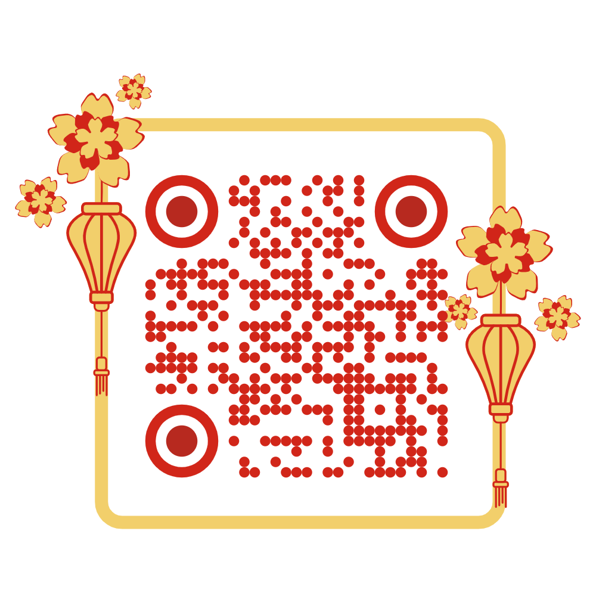

# MyVocab

[MyVocab](https://my-vocab-xi.vercel.app/)

<table>
<tr>
<td width="70%" style="vertical-align: top;">

**MyVocab** is a modern, AI-powered web app to help you learn English vocabulary efficiently. It provides definitions, Vietnamese translations, example sentences, pronunciation, synonyms, related words, and images for any English word. You can save words, organize them by topics, and test yourself with quizzes. Powered by Google Gemini AI and built with Flask.

</td>
<td width="30%" style="vertical-align: top; text-align: center;">



</td>
</tr>
</table>

---

## Features

- **Smart Dictionary**: Get English definitions, Vietnamese meanings, example sentences, IPA pronunciation, synonyms, related words, and an image for any English word.
- **Topic Management**: Organize your vocabulary by custom topics.
- **Save Words**: Save words to your personal database and manage them easily.
- **Quiz Mode**: Test your knowledge with topic-based quizzes.
- **Modern UI**: Responsive, clean, and intuitive interface.
- **AI Integration**: Uses Google Gemini for rich, contextual word data.
- **Image Support**: Fetches relevant images for words (if Pexels API key is provided).

---

## Demo

![screenshot or gif here if available]

---

## Quick Start

### 1. Prerequisites

- Python 3.12+
- A Google Gemini API key ([Get one here](https://makersuite.google.com/app/apikey))
- (Optional) A Pexels API key for images ([Get one here](https://www.pexels.com/api/))

### 2. Installation

```sh
<code_block_to_apply_changes_from>
```

### 3. Configuration

Create a `.env` file in the project root:

```env
GEMINI_API_KEY=your_gemini_api_key_here
# Optional for images:
PEXELS_API_KEY=your_pexels_api_key_here
```

### 4. Run the App

```sh
cd my_website
python app.py
```

Visit [http://localhost:5000](http://localhost:5000) in your browser.

---

## Usage

- **Search**: Enter an English word and press Enter.
- **View Details**: See definition, translation, example, IPA, synonyms, related words, and image.
- **Save**: Click "Save Word" and assign it to topics.
- **Manage Topics**: Add or remove topics as you like.
- **Quiz**: Go to "Exam" to test yourself on saved words by topic.
- **Data**: View and manage all your saved words.

---

## Project Structure

```
MyVocab/
│
├── api/                  # Vercel/production entrypoint
│   └── index.py
│
├── my_website/           # Main Flask app
│   ├── app.py            # Flask app and routes
│   ├── handle_request.py # AI, translation, and API logic
│   ├── database.py       # SQLite DB logic
│   ├── static/           # JS, CSS, client assets
│   └── templates/        # HTML templates (Jinja2)
│
├── requirements.txt      # Python dependencies
├── myvocab.db            # SQLite database (auto-created)
└── README.md
```

---

## Tech Stack

- **Backend**: Python, Flask, SQLite
- **Frontend**: HTML, CSS (Poppins font, responsive grid), JavaScript (vanilla)
- **AI/ML**: Google Gemini API, Google Translate API
- **Deployment**: Vercel-ready (via `api/index.py`)

---

## API & Database

- **Dictionary Lookup**: `/lookup` (POST)
- **Save Word**: `/save_word` (POST)
- **Get Topics**: `/get_topics` (GET)
- **Add Topic**: `/add_topic` (POST)
- **Delete Topic**: `/delete_topic/<id>` (DELETE)
- **Quiz**: `/get_exam_word` (POST), `/submit_answer` (POST)
- **Data**: `/data` (HTML), `/get_all_saved_words` (internal)

**Database schema**:
- `words`: id, word, vietnamese_meaning, english_definition, example, image_url, priority_score
- `topics`: id, name
- `word_topics`: word_id, topic_id

---

## Dependencies

- Flask
- gunicorn
- python-dotenv
- google-generativeai
- googletrans==4.0.0-rc1
- requests

---

## Troubleshooting

- **Python not found**: Ensure Python 3.12+ is installed and in your PATH.
- **Module not found**: Run `pip install -r requirements.txt` again.
- **API key error**: Check your `.env` file for typos or missing keys.
- **App not loading**: Check terminal for errors and ensure you are in the correct folder.

---

## License

This project is licensed under the MIT License - see the [LICENSE](LICENSE) file for details.

---

**Enjoy learning with MyVocab!**

---

Would you like me to write this new README to your `README.md` file? If you want to customize any section, let me know!
