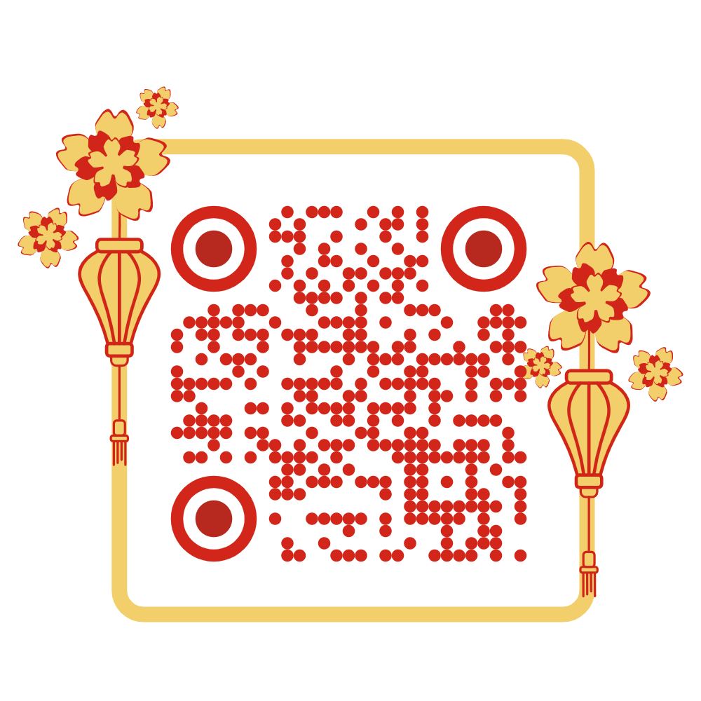

# MyVocab

<table>
<tr>
<td width="70%" style="vertical-align: top;">

[MyVocab](https://my-vocab-xi.vercel.app/) is a modern, AI-powered web app to help you learn English vocabulary efficiently. It provides definitions, Vietnamese translations, example sentences, pronunciation, synonyms, related words, and images for any English word. You can save words, organize them by topics, and test yourself with quizzes .
[&rarr; Access it here](https://my-vocab-xi.vercel.app/)

</td>
<td width="30%" style="vertical-align: top; text-align: center;">



</td>
</tr>
</table>

---

## What Makes MyVocab Special?

| Feature | Description |
| :--- | :--- |
| 📸 **Visual Learning** | Don't just read definitions—see them! Every word is paired with a vivid image, helping you build stronger memory connections. |
| 🧠 **AI-Powered Context** | Get more than just a translation. Our AI provides rich details like clear definitions, practical examples, synonyms, and related "family words". |
| 🎯 **Smart Exam Mode** | Stop wasting time on words you already know. The exam mode intelligently tests you more on the vocabulary you find difficult, making your practice sessions incredibly efficient. |
| 📚 **Personalized Collection**| Save any word with a single click. Organize your personal dictionary into custom topics to focus your learning on what's important to you. |
---

## Tech Stack


---

## Demo
[Click hiaaaa:))](./images)


---

## Usage

- **Search**: Enter an English word and press Enter.
- **View Details**: See definition, translation, example, IPA, synonyms, related words, and image.
- **Save**: Click "Save Word" and assign it to topics.
- **Manage Topics**: Add or remove topics as you like.
- **Quiz**: Go to "Exam" to test yourself on saved words by topic.
- **Data**: View and manage all your saved words (password-protected).

---

## Project Structure

```
MyVocab/
│
├── api/
│   └── index.py          # Vercel entrypoint (exposes `app`)
│
├── app.py                # Flask app and routes
├── handle_request.py     # Gemini / Pexels / dictionary lookups
├── database.py           # PostgreSQL logic + schema migration
│
├── static/               # JS, CSS, client assets
│   ├── style.css
│   ├── script.js
│   ├── data.js
│   ├── exam.js
│   └── manage_topics.js
│
├── templates/            # HTML templates (Jinja2)
│   ├── index.html
│   ├── exam.html
│   ├── data.html
│   └── manage_topics.html
│
├── requirements.txt      # Python dependencies
├── vercel.json           # Vercel build + routing config
├── LICENSE
└── README.md
```

---

### Database Schema

- `words`: id, word, vietnamese_meaning, vietnamese_keywords, english_definition, example, image_url, priority_score, pronunciation_ipa, synonyms_json, family_words_json
- `topics`: id, name
- `word_topics`: word_id, topic_id

---


## Deployment (Vercel)

The tables are created automatically on the first request, so a brand new
PostgreSQL database needs no manual setup.

### Environment Variables

Set these in **Project Settings -> Environment Variables**:

| Variable | Required | Purpose |
| :--- | :--- | :--- |
| `DATABASE_URL` | Yes | PostgreSQL connection string (Neon, Supabase, Vercel Postgres...). |
| `FLASK_SECRET_KEY` | Yes | Signs the session cookie. Without it every deployment shares a public default and the `/data` password can be bypassed. Use a long random value. |
| `VIEW_DATA_PASSWORD` | Yes | Password for the `/data` page. `/api/verify_password` returns 500 if unset. |
| `GEMINI_API_KEY` | Yes | Google AI Studio key. Without it lookups return no definition. |
| `PEXELS_API_KEY` | No | Image lookups; word images are skipped if unset. |
| `GEMINI_MODEL` | No | Defaults to `gemini-2.5-flash`. Override to change model. |

### Local development

```bash
python -m venv .venv
.venv/Scripts/activate        # Windows;  source .venv/bin/activate on macOS/Linux
pip install -r requirements.txt
# export the variables above, then:
flask --app app run --debug
```

---

## License

This project is licensed under the MIT License - see the [LICENSE](LICENSE) file for details.

---

**Enjoy learning with MyVocab!**


