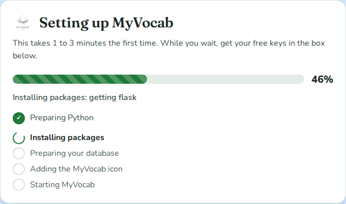
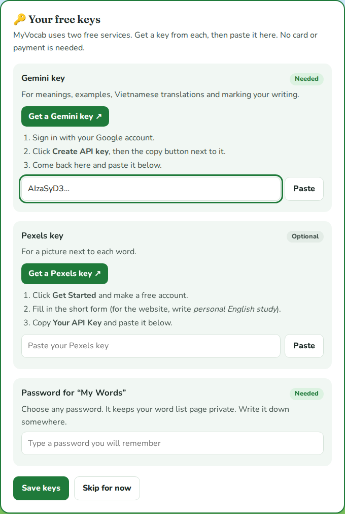
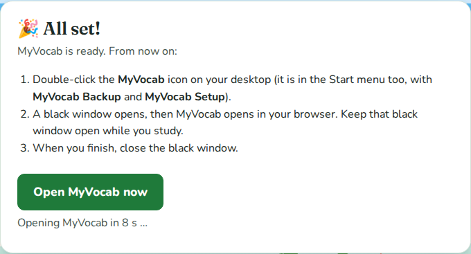
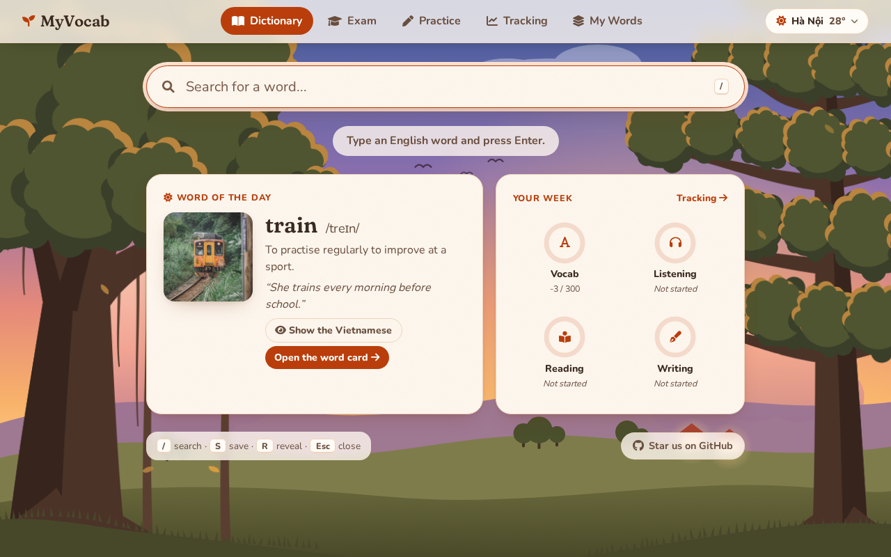
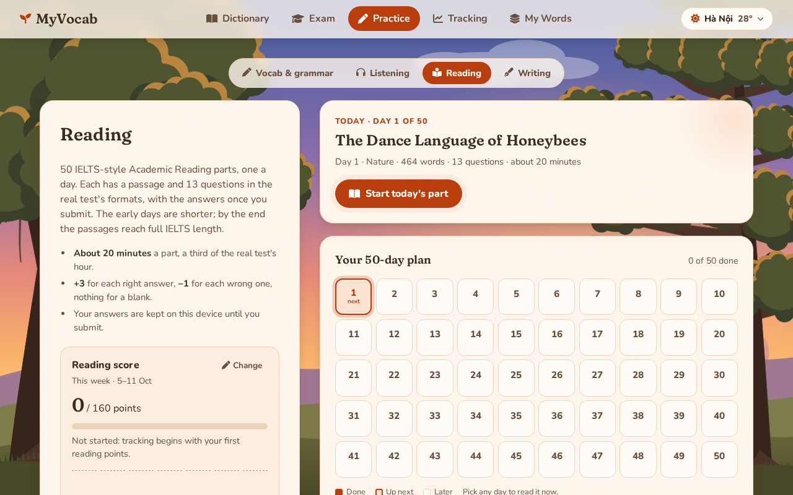
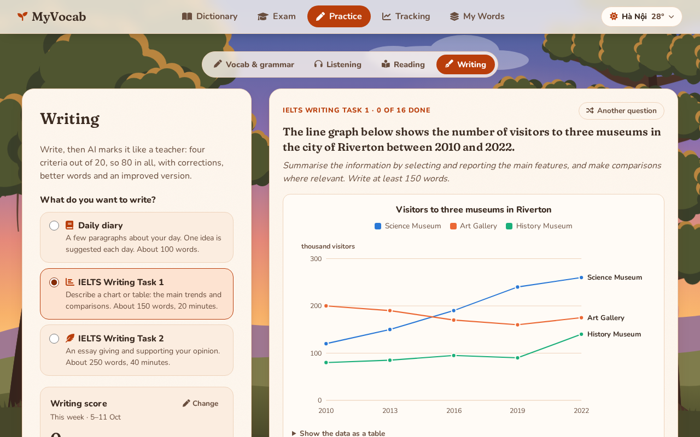

# MyVocab

MyVocab is a modern, AI-powered app to help you learn English vocabulary efficiently. It provides definitions, Vietnamese translations, example sentences, pronunciation, synonyms, related words, and images for any English word. You can save words, organize them by topics, and test yourself with quizzes.

MyVocab runs on your own computer: see [Install on Windows](#install-on-windows-no-technical-knowledge-needed)
or [Run it on your computer](#run-it-on-your-computer). There is no online copy.

---

## What Makes MyVocab Special?

| Feature | Description |
| :--- | :--- |
| 📸 **Visual Learning** | Don't just read definitions—see them! Every word is paired with a vivid image, helping you build stronger memory connections. |
| 🧠 **AI-Powered Context** | Get more than just a translation. Our AI provides rich details like clear definitions, practical examples, synonyms, and related "family words". |
| ✍️ **Grammar & Vocab Practice** | Fill the blank, fix the mistake, translate, or use a word in your own sentence. AI marks your grammar and vocabulary and explains every mistake in Vietnamese. |
| 🎯 **Smart Exam Mode** | Stop wasting time on words you already know. The exam mode intelligently tests you more on the vocabulary you find difficult, making your practice sessions incredibly efficient. |
| 📚 **Personalized Collection**| Save any word with a single click. Organize your personal dictionary into custom topics to focus your learning on what's important to you. |

---

## Install on Windows (no technical knowledge needed)

Download **one file** and double-click it. A window opens and does every step
by itself, with a progress bar. At the end, a **MyVocab** icon is on your
desktop, and from then on you only click that icon.

### The first time (about 5 minutes, with internet)

**Step 1. Download the setup file**

<p align="center"><a href="https://github.com/ntuanh/MyVocab/releases/latest/download/MyVocab-Setup.bat"><b>⬇ Download MyVocab-Setup.bat</b></a></p>

If the browser warns about the file, choose **Keep** (in Edge: click **...** next to the file first, then **Keep**).

**Step 2. Double-click `MyVocab-Setup`** (in your **Downloads** folder)

If a blue box says *Windows protected your PC*, click **More info**, then
**Run anyway**. A window opens and works through 4 steps by itself:

| | What the window does | Do you need to do anything? |
| :---: | :--- | :--- |
| 1 | Downloads MyVocab into its own folder | No |
| 2 | Looks for your words and keys from before: a backup file (`myvocab-....sql`) on the Desktop, in Downloads or Documents, or on a USB stick, and the keys in an old MyVocab folder | If it finds a backup, press **Enter** to load it |
| 3 | Installs Python 3.12 if the computer does not have it. A small window shows its progress bar | No |
| 4 | Opens the **setup page** in your browser: a progress bar for installing packages, preparing your database and adding the icons | Paste your keys (step 3 below) |

<p align="center"></p>

If Windows Firewall asks about *Python* or *postgres*, click **Cancel**.
MyVocab only talks to your own computer.

> [!NOTE]
> **What a new computer starts with:** every word and topic from the word pack
> (706 words, B1 to C1, with meanings, pictures and pronunciation), and the
> weekly targets. Its scores, history and writing start at zero.
>
> **Want your own scores and writing too?** Before step 2, make a backup on
> the old computer: Start menu → **MyVocab Backup** (or double-click
> **backup** in the old MyVocab folder). Put the `myvocab-<date>.sql` file it
> makes on this computer's **Desktop** or on a USB stick. Step 2 finds it and
> loads everything.

**No file wanted?** Press **Windows + R**, paste this line and press **Enter**.
It does exactly the same:

```
powershell -ExecutionPolicy Bypass -c "irm https://raw.githubusercontent.com/ntuanh/MyVocab/main/tools/windows_setup.ps1 | iex"
```

**Step 3. Paste your free keys** into the box on the setup page, while the bar runs

> [!TIP]
> **Gemini key** (needed: meanings, examples, Vietnamese, marking your writing)
> 1. Open **<https://aistudio.google.com/apikey>** and sign in with a Google account.
> 2. Click **Create API key**, then copy it.
> 3. Click **Paste** next to the Gemini box on the setup page.

> [!TIP]
> **Pexels key** (optional: a picture next to each word)
> 1. Open **<https://www.pexels.com/api/>**, click **Get Started** and make a free account.
> 2. Fill in the short form (for the website, write *personal English study*).
> 3. Copy **Your API Key** and click **Paste** next to the Pexels box.

Then click **Save keys**. (The *My Words* password is optional: on your own
computer your word list opens without it.)
MyVocab checks each key right away. A green tick means the key works. A red
message means the key was copied wrong: copy it again and paste it.

<p align="center"></p>

No keys yet? Click **Skip for now**. Your saved words, Exam, Listening and
Reading still work. To add the keys later: Start menu → **MyVocab Setup**.
If step 2 found your keys in an old MyVocab folder, they are already filled in.

**Step 4. Done.** When the bar reaches 100%, MyVocab opens by itself.

<p align="center"></p>

### Every time

1. Double-click the **MyVocab** icon on your desktop (it is in the Start menu too).
2. A black window opens, then MyVocab opens in your browser.
3. Keep the black window open while you study (you can minimise it).
4. When you finish, close the black window. That stops MyVocab.

Closed the browser tab by mistake? Double-click the icon again: it only
opens the page again.

The Start menu also has:

| Start menu | What it does |
| :--- | :--- |
| **MyVocab** | Starts MyVocab (same as the desktop icon) |
| **MyVocab Backup** | Saves a copy of your words and opens the folder it is in. Do this **once a week** |
| **MyVocab Setup** | Opens the setup page again, to change your keys or password |

### Getting a new version

When a new version is out, a small **⬆ Update** button appears in the
bottom-left corner of MyVocab (it checks about every half hour). Click it to
see what is new, then click **Update now**:

1. MyVocab downloads the new version and saves a backup of your words.
2. The black window closes, and a new one opens by itself after a few seconds.
3. The page reloads and says **Updated to v…**. Your words, keys and backups are kept.

Running **MyVocab-Setup** again also updates MyVocab.

### If something goes wrong

| You see | Do this |
| :--- | :--- |
| The browser will not download the file | Use the **Windows + R** line above instead. |
| *The setup stopped* | Check your internet and double-click **MyVocab-Setup** again. It continues where it stopped. |
| *Python could not be installed automatically* | Install it yourself: <https://www.python.org/ftp/python/3.12.10/python-3.12.10-amd64.exe>. Tick **Add python.exe to PATH**, click **Install Now**, then run **MyVocab-Setup** again. |
| *Installing packages failed* | Check your internet and run **MyVocab-Setup** again. If it still fails: delete the **.venv** folder in the MyVocab folder (see below) and try once more. |
| The setup page shows *Something went wrong* | Read the last lines in the black window: they say what is missing. Restarting the computer and trying again often helps. |
| The browser says *This site can't be reached* | Wait 10 seconds and refresh the page. Make sure the black window is still open. |
| No icon on the desktop | Start menu → **MyVocab Setup** (or run **MyVocab-Setup** again): it makes the icons again. |
| Your old words are not there | The backup was not found in step 2. Close MyVocab, delete the **.localdb** folder in the MyVocab folder, put the backup file on the Desktop, and run **MyVocab-Setup** again. Only do this if you have not saved new words on this computer yet. |
| *You have not saved any words yet*, but you have | The database did not start. Close the black window and open MyVocab again. (Since v1.4 this fixes itself, even after the computer was switched off with MyVocab open.) |
| *Out of quota*, or the AI marking stops | The free AI allows about 20 requests a day. Try again tomorrow. |

**Where is the MyVocab folder?** Press **Windows + R**, type
`%LOCALAPPDATA%\MyVocab` and press **Enter**. It holds your keys (`.env`), your
database (`.localdb`) and your backups (`backup`).

---

## Run it on your computer

`run.py` sets everything up the first time and starts MyVocab after that, the
same way on Linux, macOS and Windows. It needs **Python 3.12** (3.11 also
works): the database it brings along has no build for 3.13 or newer yet.

### Linux or macOS

```bash
git clone https://github.com/ntuanh/MyVocab.git
cd MyVocab
./run.sh                          # same as: python3 run.py
python3 tools/make_shortcut.py    # once: a desktop icon to double-click instead
```
On Ubuntu or Linux Mint, also run `sudo apt install python3-venv` once.

### Windows

See [Install on Windows](#install-on-windows-no-technical-knowledge-needed).
`MyVocab-Setup.bat` (attached to each GitHub release) runs
`tools/windows_setup.ps1` from GitHub. That script:

- downloads the `main` branch into `%LOCALAPPDATA%\MyVocab`. On an update, it
  makes a backup first;
- finds a `myvocab-*.sql` backup and an old `.env` (only its keys are copied);
- installs Python 3.12 for this user if it is missing (`tools/get_python.ps1`,
  no administrator rights needed);
- runs `install.bat` (`run.bat --setup`).

The shortcuts open `run.bat` (MyVocab), `backup.bat` (MyVocab Backup) and
`install.bat` (MyVocab Setup). In a cloned or extracted folder, double-click
`install.bat` the first time.

### What the first run does

- creates `.venv` and installs the exact package versions from
  `requirements.txt` and `requirements-local.txt` (again only when they change);
- creates `.env` from `.env.example` and, if no database is set, gives MyVocab
  its own database on this computer (a real PostgreSQL from the `pgserver`
  package, nothing installed system-wide; data in `.localdb/`);
- on a new computer, loads your newest backup from `backup/` into that database;
- opens a setup page in the browser (`tools/setup.html`, served by `run.py` on
  a random local port). It shows a progress bar and has a box for the keys
  (`GEMINI_API_KEY`, `PEXELS_API_KEY`, `VIEW_DATA_PASSWORD`). Each key is checked
  with its service before it is saved to `.env`;
- starts the app at http://127.0.0.1:5000, and the setup page moves on to it.
  If MyVocab is already running, the shortcut only opens the browser.

To change the keys later, run `python3 run.py --setup` (Windows: *MyVocab Setup* in the Start menu),
or edit `.env` ([Settings](#settings-env) says what each key is
for). Closing the window (or Ctrl+C) stops the app and its database.

| To... | Do |
| :--- | :--- |
| use another port | `PORT=5001 ./run.sh` (Windows: `set PORT=5001` then `run.bat`) |
| not open the browser (and no setup page) | `OPEN_BROWSER=0 ./run.sh` |
| use another PostgreSQL database | put its `DATABASE_URL` in `.env` |

### Moving your words to another computer

There are two ways:

| | What comes over | How |
| :--- | :--- | :--- |
| **Word pack** | Every word and topic, and the weekly targets. Scores, history and writing start at zero | Nothing to do: every new install loads `data/word_pack.json` |
| **Backup** | Everything: words, scores, history, writing | Make a backup here, then load it there (below) |

The word pack is your words as they were at the last release:
`dev/release.py` saves them into `data/word_pack.json` each time
(`tools/word_pack.py export`). Installed copies add new words from it after
an update, never twice. A word someone deleted is not added again, and a word
they changed keeps their changes.

To take everything with a backup:

1. Here: `python3 tools/local_db.py backup` (Windows: `.venv\Scripts\python tools\local_db.py backup`).
   It writes `backup/myvocab-<date>.sql` (about 200 KB).
2. Copy the MyVocab folder (or a fresh clone) to the other computer, with that
   `backup/` folder and your `.env`. Leave `.venv` and `.localdb` behind; they
   are made for each computer.
3. Start it there: the first run creates a new database and loads the backup.

`backup/`, `.env` and `.localdb/` are in `.gitignore`: they never reach GitHub.
`tools/local_db.py restore FILE` loads a backup by hand; it refuses to
overwrite a database that already has words unless you add `--force`.

### Adding the word lists

Two ready-made lists come with MyVocab, each word with a Vietnamese meaning, a
definition and an example:

| File | Words | Level |
| :--- | :--- | :--- |
| `data/b1_words.json` | 500 Destination B1 words, 20 in each of 25 topics | B1 |
| `data/b1_c1_words.json` | 200 more, 8 in each of the same 25 topics | 50 upper B1, 76 B2, 74 C1 |

B2 and C1 words also go into a **Level B2** or **Level C1** topic, so the Exam
can test one level at a time. Words you already have are skipped.

To fill a database with the B1 list:
```bash
.venv/bin/python dev/seed_words.py --limit 200 --commit --allow-no-image
.venv/bin/python dev/fill_missing.py --commit
```
Leave out `--limit 200` for all 500 words in 25 topics, and `--allow-no-image`
if `PEXELS_API_KEY` is set. For the B1-C1 list, add `--data data/b1_c1_words.json`.
Pexels allows 200 pictures an hour; if it stops there, run it again an hour
later, and it carries on where it stopped. `fill_missing.py` adds pictures (`PEXELS_API_KEY`),
pronunciation and synonyms (free) and family words (`GEMINI_API_KEY`); run it
again after adding a key.

### How big is it?

| Part | Size |
| :--- | :--- |
| The code and content (Python, pages, 700 words, 50 reading parts, prompts) | about 3 MB |
| `.venv`: Python packages, including the database program | about 80 MB |
| `.localdb`: the database (your data in it is about 8 MB; a backup is about 200 KB) | about 65 MB |
| Memory while running: the app (two Python processes) and the database | about 160 MB |

---

## Tech Stack


---

## Demo

| Home | Reading | Writing |
| :---: | :---: | :---: |
|  |  |  |

---

## Usage

- **Search**: Enter an English word and press Enter.
- **View Details**: See definition, translation, example, IPA, synonyms, related words, and image.
- **Meanings on hover**: point at any word under *Similar* or *Family* (or focus it with Tab; on a phone, hold it) and a small box shows its English meaning and part of speech. It uses your own saved definition when you have the word, otherwise Wiktionary (free, no key, no AI quota), and each word is looked up only once (`word_glosses`).
- **Save**: Click "Save Word" and tick its topics, or click *Save, and let AI pick the topic*: the dialog closes at once, a small card in the corner follows the word while AI files it under the one topic it fits best (making a new topic only when none of yours fits), and you can keep searching meanwhile. Each AI pick is one Gemini request; the word is saved even if the AI fails.
- **Manage Topics**: Add or remove topics as you like.
- **Quiz**: Go to "Exam" to test yourself on saved words by topic.
- **Practice**: Go to "Practice" and pick a type:
  - *Fill the blank*: AI writes a sentence with one of your words missing; type the word in the right form.
  - *Fix the mistake*: rewrite a sentence that has one typical learner mistake.
  - *Translate*: turn a Vietnamese sentence into English using your word.
  - *Use it in a sentence*: write your own sentence with a saved word.
  - *Check my writing*: paste any English and get it corrected.

  Results feed the same priority score as the exam, so words you miss come back sooner.
- **Vocab score**: set a weekly points goal (300 to start) on the Practice page. Weeks run Monday to Sunday, and whatever a week falls short of is added to the next week's goal until you make it up (points beyond a goal are not carried). The panel shows this week's points, what is carried over, about how many a day you still need, each day of the week, your streak of weeks that met the goal, and the last 4 weeks. A new goal counts from the current week on.
- **Tracking**: the Tracking button in the top bar opens every skill's score, one band each: Vocab, Listening, Reading and Writing, each with its own weekly target (300 to start). **Set targets** sets all four at once; a band's *Change* sets just that one, and a new target counts from this week on. A tile per band shows this week at a glance; open one for its target, the last 8 weeks as columns against each week's target (hover or focus a week for its numbers, or open the table), and how many finished weeks met it. Link straight to a band with `/tracking#listening`. A band's tracking starts in the week of its first points, so a target set before you practise that skill never piles up a shortfall.
- **Listening**: Practice → *Listening* plays 50 episodes of BBC Learning English's *6 Minute English* in the BBC's own YouTube player (newest first; filter by To do, Done or topic; link to one with `/listening#VIDEO_ID`). Watch an episode, do its BBC quiz or worksheet (the link is in the video's description on YouTube; from Vietnam the BBC site needs a VPN or Tor Browser), then enter how many you got right. Each right answer wins 4 points and each wrong one loses 2 (5 out of 6 is +18). Only your first score for an episode counts; later ones are kept as practice. The points go to the Listening band on the Tracking page.
  **Worksheet & transcript**: under the video, keep the episode's own files: download the BBC worksheet, transcript or audio, then drop it on the box or press *Add a file* (PDF, Word, text, PNG/JPG/WebP pictures or MP3, up to 20 MB, 10 per episode). PDFs, text and pictures open right under the video, and MP3s play there. An episode with files shows a paperclip in the list. The files are kept in your own database, so your backups carry them. They are private: online they need the My Words password, and they never go into the word pack or to GitHub. Each file is checked by its contents, not only its name, so a web page renamed to .pdf is refused. Online (Vercel) a file can be at most about 4 MB.
- **Reading**: Practice → *Reading* is a 50-day plan of IELTS-style Academic Reading parts written for MyVocab, one a day (the real Cambridge tests are copyrighted). Each part is a passage in lettered paragraphs with 13 questions in the real test's formats: True/False/Not Given, sentence completion with a word limit, multiple choice, which paragraph contains…, and matching headings. Passages start at about 450 words and grow to full IELTS length (about 700) by day 50. A part opens with the passage beside the questions, as in the computer-based test, and a 20-minute timer; on a phone the two are tabs. Answers are kept on your device until you submit; the server marks them and shows the answer key, with a button that jumps to the paragraph each answer is in, and a rough band (the part's score scaled to 40 questions). Each right answer wins 3 points, each wrong one loses 1, a blank costs nothing, and only your first try at a part counts. The plan shows today's part, every day's score and your day streak; link to a part with `/reading#part-12`.
  Every marked answer scores whole points by how hard its sentence is: the practice type (Fill the blank 1, Fix the mistake 2, Translate 3, Use it 3), plus 1 for every 4 words and 1 for each word of 7+ letters, up to 20. Right wins them all; *almost* loses a third and wrong (or *Show answer*) loses half, rounded down. Answers nothing could mark, and *Check my writing*, score nothing. Points and goals are kept per skill, ready for listening, reading and writing scores.
- **My Words**: View and manage all your saved words. It opens straight away on your own computer, so the password is optional.
- **Getting around**: the bar at the top of every page links Dictionary, Exam, Practice and My Words, and lets you change the look.
- **Writing**: Practice → *Writing*. Each time, choose a **daily diary** (an idea is suggested each day, with three of your saved words to try), **IELTS Writing Task 1** (16 charts and tables to describe: line graphs, bar charts, pie charts and tables, drawn on the page, with invented practice data) or **IELTS Writing Task 2** (40 essay questions in every common question type). Tasks have the real test's time (20 or 40 minutes) and word targets (150 or 250); a word meter shows your progress, and drafts are kept on your device. **Mark my writing** sends it to Gemini, which marks it like a teacher on four criteria out of 20, so **80 in all** (for IELTS tasks, the official criteria, with a band estimate): a score ring and a bar per criterion with comments, what you did well, every correction marked in your text with an explanation, better words, how you used your words to try, an improved version, one thing to practise next and a short summary in Vietnamese. **Revise this piece** lets you improve it and mark it again. Your score is your Writing points: one diary a day and each IELTS question once; revisions are practice. If the AI is busy or out of its daily quota, the piece is kept (with LanguageTool's grammar notes meanwhile) and **Mark it now** tries again later. Past writing is listed under *Your writing*. `GEMINI_WRITING_MODEL` moves marking onto another model and its own quota.
- **Today** (on the home page): a word of the day picked from your saved words, the same all day and new tomorrow (its Vietnamese stays hidden until you ask, and one click opens its full card), beside a ring for each skill showing how its week is going.
- **Effects**: confetti and an achievement card when you reach a weekly target or score a perfect reading part or listening episode, points that float up from the answer that won them, numbers that count up, bars that shimmer and turn gold at the target, flickering streak flames, cards that rise into place, and on dry mornings and evenings a few leaves drifting down from the trees. All of it is off when your system asks for reduced motion.
- **Live sky**: the button at the top right shows the place, temperature and weather. Open it to pick a place (search any city, scroll the list, or use your location). The page then looks like that place right now: a bright *morning*, a golden *evening* around sunset, or a calm *night*, taken from its real sunrise and sunset, with clouds, rain, snow, fog or a storm when the weather has them. Two big trees, a banyan and an Indian almond, frame every page: they lean in the wind (more in rain, most in a storm), hold snow when it snows, and fireflies come out around them on dry nights. *Live* follows the place; Morning, Evening or Night pins one look. The rain and snow animation can be switched off.
  Weather comes from [Open-Meteo](https://open-meteo.com/) (free, no API key), straight from the browser, and is asked for again at most every 15 minutes. Only the chosen place's coordinates are sent.
- **Keyboard shortcuts**: `/` search, `S` save the word, `R` reveal the meaning, `N` next question, `Esc` close a dialog.
  Your recent searches and the topics you last ticked are remembered in your browser.

---

## Project Structure

Where to look when you change something:

| To change... | Look in |
| :--- | :--- |
| a page's layout | `templates/<page>.html`, and the shared pieces in `templates/partials/` |
| how it looks | `static/css/style.css` (colour tokens at the top, one numbered section per page) |
| what a page does in the browser | `static/js/<page>.js` |
| what the server does (routes) | `app.py`, which calls the code in `myvocab/` |
| words, reading parts, writing prompts | `data/` |
| installing, starting, updating | `run.py` and `tools/` |
| content and releases (only you run these) | `dev/` |
| checking nothing broke | `tests/run_all.py` |

```
MyVocab/
├── app.py                 # Flask: every page and /api route
├── run.py                 # Sets up and starts MyVocab on a computer (Windows, Linux, macOS)
├── run.bat  run.sh        # Start it (the desktop icon opens these)
├── install.bat            # Windows: set this folder up / change the keys (Start menu: MyVocab Setup)
├── backup.bat             # Windows: save your words to backup/ (Start menu: MyVocab Backup)
├── MyVocab-Setup.bat      # Windows: the one file to download; installs or updates everything
├── requirements.txt       # Python packages (pinned)
├── requirements-local.txt # ... plus the database program, for a computer
├── requirements-dev.txt   # ... plus what the tests need (Playwright)
├── .env.example           # Template for .env (keys and settings; .env is never committed)
├── vercel.json            # Old Vercel build and routing (the online copy is switched off)
│
├── myvocab/               # The app's Python code, used by app.py
│   ├── database.py        # PostgreSQL: words, topics, points, targets, attempts (+ schema)
│   ├── handle_request.py  # Looking a word up: dictionary API, Gemini, Pexels
│   ├── practice.py        # Practice exercises and AI marking
│   ├── listening.py       # Listening episodes and how their scores become points
│   ├── reading.py         # Reading parts: loading and checking them, marking, the plan
│   ├── writing.py         # Writing: prompts, AI marking out of 80, points
│   └── updates.py         # New versions: asks GitHub for the newest release, starts an update
│
├── templates/             # One file per page
│   ├── index.html  exam.html  practice.html  listening.html  reading.html
│   ├── writing.html  tracking.html  data.html  manage_topics.html
│   └── partials/          # Pieces shared by pages
│       ├── nav.html           # Top bar, weather layers, Update button
│       ├── trees.html         # The two big trees (drawn by dev/draw_trees.py)
│       ├── goal_panel.html    # A skill's weekly target panel
│       ├── practice_tabs.html # Vocab / Listening / Reading / Writing tabs
│       └── rules/             # How each skill scores: vocab, listening, reading, writing
│
├── static/
│   ├── css/style.css      # All styles
│   ├── js/                # One script per page, plus shared ones:
│   │                      #   theme, sky (weather), fx (effects), goals, charts, update
│   └── img/               # Favicon, the three scenes, clouds, rain and snow
│
├── data/
│   ├── b1_words.json      # 500 Destination B1 words with meanings and examples
│   ├── b1_c1_words.json   # 200 more words, upper B1 to C1, each with its level
│   ├── word_pack.json     # Every saved word and topic, no scores: what new installs start with
│   ├── bbc_6min.json      # 50 BBC 6 Minute English episodes
│   ├── reading/           # 50 IELTS-style reading parts with answers
│   └── writing/           # Diary ideas, 16 Task 1 charts, 40 Task 2 questions
│
├── tools/                 # Run by installed copies
│   ├── windows_setup.ps1  # What MyVocab-Setup.bat runs: download, find backup and keys, set up
│   ├── get_python.ps1     # Installs Python 3.12 on Windows when it is missing
│   ├── setup.html         # The setup page: progress bar and the keys box
│   ├── local_db.py        # The database on this computer: start, stop, backup, restore
│   ├── make_shortcut.py   # Desktop and Start menu icons
│   ├── word_pack.py       # Export / import the word pack (words and topics, no scores)
│   └── update.py          # Puts a new release in: download, backup, close, copy, reopen
│
├── tests/                 # run_all.py and 9 suites (see Testing); fixtures/
│
├── dev/                   # Only for the developer
│   ├── release.py         # Publish a new version (a GitHub release)
│   ├── seed_words.py      # Load a word list (data/*.json) into a database
│   ├── fill_missing.py    # Add missing pictures, IPA, synonyms, family words
│   └── draw_trees.py      # Draw templates/partials/trees.html
│
├── api/index.py           # Old Vercel entry point (exposes `app`)
└── docs/images/           # Pictures for this README
```

---

### Database Schema

- `words`: id, word, vietnamese_meaning, vietnamese_keywords, english_definition, example, image_url, priority_score, pronunciation_ipa, synonyms_json, family_words_json
- `topics`: id, name
- `word_topics`: word_id, topic_id
- `practice_points`: id, created_at, skill, word_id, mode, verdict, worth, points (one row per marked answer or counted listening score)
- `listening_attempts`: id, created_at, episode_id, correct, total, points, counted (one row per listening score; only an episode's first counts)
- `word_glosses`: word, definition, part_of_speech, source, fetched_at (meanings shown on hover; a miss is retried after 7 days)
- `listening_docs`: id, uploaded_at, episode_id, filename, content_type, size, data (an episode's own files: worksheet, transcript, audio)
- `reading_attempts`: id, created_at, part_id, correct, total, points, counted, answers (one row per submitted reading part; only a part's first counts)
- `writing_pieces`: id, created_at, kind, prompt_id, prompt, text, words, revision_of, status, score, band, feedback, counted, points, scored_at (one row per piece of writing and its marks)
- `skill_goals`: skill, week_start, target (a skill's weekly goal from that Monday on)

---


## Publishing a new version

Installed copies of MyVocab update from **GitHub releases**, not from every
push. That way, unfinished work on `main` never reaches anyone. When a set of
changes is ready, run this on your computer:

```bash
git add -A && git commit -m "feat: what you added"   # commit as usual
python3 dev/release.py                             # v1.1 -> v1.2: pushes main, publishes the release
```

It saves your words into the word pack (committed if they changed), so new
computers start with them. Then it runs the tests and stops if any fail
(see [Testing](#testing)). Then it
shows the new version number and a "What's new" list made from the commit
messages since the last release, and asks before publishing. You can also give
the version and notes yourself: `python3 dev/release.py 2.0 --notes "- Speaking practice"`.
It needs the GitHub CLI (`gh auth login`).

Within about half an hour, every installed MyVocab shows the **Update** button
with that list:

- `myvocab/updates.py` asks GitHub for the newest release (`/api/update/status`);
- `static/js/update.js` shows the button and follows the update;
- `run.py` starts `tools/update.py`, which:
  1. downloads the release;
  2. saves a backup to `backup/myvocab-<date>-before-<version>.sql`;
  3. closes MyVocab and puts the new files in;
  4. opens MyVocab again, and `run.py` installs any new packages.

`.env`, `.venv`, `.localdb` and `backup/` are not in a release, so they stay.
The installed version is in `.version`. New installs from `MyVocab-Setup.bat`
get the newest release too.

The button only shows in a copy that `run.py` started and that is not a git
clone. Your own clone updates with `git pull`.

### Testing

`tests/` has 9 suites, about 340 checks. Browser checks with Playwright cover
every page on desktop and phone, the effects, the trees, the update button and
the setup page. Logic checks cover marking, points and targets.
`tests/run_all.py` runs them against a **separate** copy of MyVocab: it gets its
own database, filled from your newest backup, so your words are never touched.

```bash
.venv/bin/pip install -r requirements-dev.txt          # once
.venv/bin/python -m playwright install chromium        # once
.venv/bin/python tests/run_all.py                      # all suites, about 3 minutes
.venv/bin/python tests/run_all.py reading writing      # only some
.venv/bin/python tests/run_all.py --install            # plus a full first install (needs internet)
```

`dev/release.py` runs them before every release.

---

## Settings (.env)

`run.py` makes `.env` from `.env.example` the first time, and the setup page
fills in the keys. Edit `.env` to change any of these:

| Variable | Required | Purpose |
| :--- | :--- | :--- |
| `DATABASE_URL` | No | PostgreSQL connection string. `run.py` sets it to the database on this computer; put another one here to use that instead. |
| `FLASK_SECRET_KEY` | No | Signs the session cookie. `run.py` sets a long random value the first time. |
| `VIEW_DATA_PASSWORD` | No | Password for the `/data` page. On your own computer it opens without one. |
| `GEMINI_API_KEY` | Yes | Google AI Studio key. Without it lookups return no definition. |
| `PEXELS_API_KEY` | No | Image lookups; word images are skipped if unset. |
| `GEMINI_MODEL` | No | Defaults to `gemini-3.5-flash-lite`. Set this if that model is retired. Prefer a `-lite` model: the free tier allows only 20 requests a day per model, and the non-lite ones spend seconds reasoning before answering. |
| `GEMINI_PRACTICE_MODEL` | No | Model for the Practice page; defaults to `GEMINI_MODEL`. The daily quota is per model, so a different model here keeps practice from using up dictionary lookups. |
| `GEMINI_WRITING_MODEL` | No | Model that marks writing; defaults to `GEMINI_PRACTICE_MODEL`, then `GEMINI_MODEL`. Each piece marked is one request. |
| `WRITING_TIMEOUT` | No | Seconds to wait for a piece to be marked (default 90; an essay takes longer than a word lookup). |
| `LANGUAGETOOL_URL` | No | Grammar checker used when Gemini is unavailable. Defaults to LanguageTool's free public API. |
| `LANGUAGETOOL_LANGUAGE` | No | Defaults to `en-GB`, matching the British spelling of the saved words. |
| `TRANSLATE_TIMEOUT` | No | Seconds for the Vietnamese fallback when Gemini gives none (default 5). It uses MyMemory's free API, no key needed. |
| `MYVOCAB_DEBUG` | No | `1` runs Flask in debug mode on an installed copy. A git clone always does; installed copies do not. |

### How Practice saves Gemini requests

- One request writes a whole batch of exercises.
- An answer that matches the expected one is marked without a request.
- *Fill the blank* falls back to the example sentences saved with your words when Gemini is unavailable, and *Use it in a sentence* never needs Gemini to start.
- When Gemini cannot mark an answer, LanguageTool still checks grammar and spelling (its explanations are in English).

---

## License

This project is licensed under the MIT License - see the [LICENSE](LICENSE) file for details.

---

**Enjoy learning with MyVocab!**


